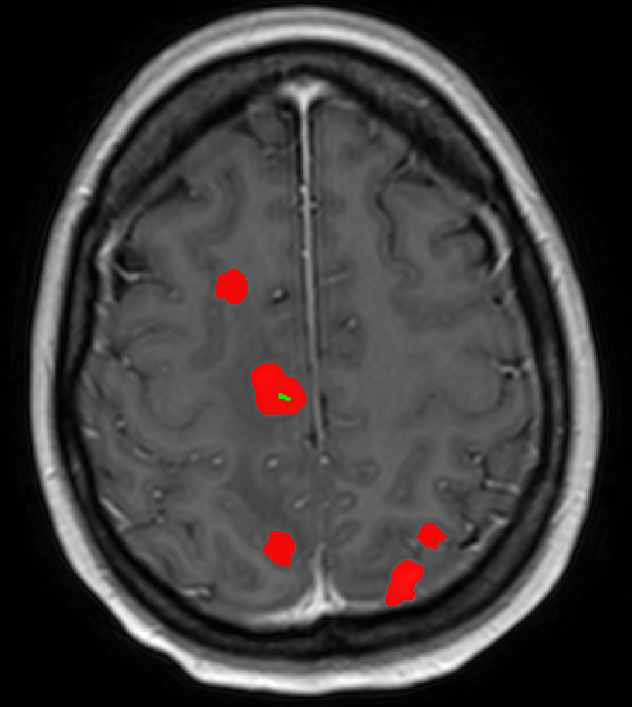

# Postmarket Deployment Section

For full documentation visit [mkdocs.org](https://www.mkdocs.org).

## Audience
This post is for some humans.

## What is post-deployment surveillance

## Why is it necessary?
### Model Drift
There are two main types of model drift: data drift and concept drift.
#### Data Drift
Changes in distribution of **serving data** relative to training data over time.

Example: 
- Scan Parameters are adjusted due to changes in scanner hardware, or scan time contraints.   
 
Detecting drift:

- Define which subgroups to assess (e.g. gender, age, image slice thickness)
  
    - difference in distribution of parameters between outliers and rest of data
      - split dataset into two, four, etc. --> looking at subdistribution difference of a given variable
      - k-means clustering across all parameters and performance
    - this can help flag serving data that may yield subpar performance
    - this also helps with targeted data sharing asks - help define data requests from users, if an option

- Define metric(s) and threshold(s) to measure and detect drift.
    
    - e.g. distribution of Female:Male in training data is significantly different than that seen in serving data 

- Define what actions to take if drift is detected. 

    - Determine whether drift affects serving performance by reaching out to users.
     
    - Obtain new data that doesn't overlap with current model's training distribution (e.g. males under 50) from impacted users, if possible.

- Anticipate most likely situations drift can occur

    - New guidelines for imaging protocol optimization may trickle down to imaging centers while new medications that requires a specific, nuanced protocol may be more quickly adopted.

#### Concept Drift
Changes in meaning or definition of serving data labels change. A classic example in ML is that of certain long-form emails with many attachments originally labeled spam are now considered not spam.

In medical imaging, not only might scanner parameters change (as in **data drift**) but the standard definition for a positive label on those images as well.

Example:
- the standard definition of an edema label that was applied to brain tumor MRIs changes to include/not include certain positive FLAIR signal in a specific location.
- microhemorrhages are re-classified or sub-classified based on size, and this becomes the standard in T2*GRE/SWI image reading.

**How might you overcome concept drift?**
Depending on the specific scenario and extent of definition change, adapting to concept drift may be possible. For example, in the case of the microhemorrhage mentioned above, perhaps lesions below a certain diameter of 5mm are sub-classified as "small" and physicians may expect this from any image detection model applied to microhemorrhages. Software can be designed to detect segmentation masks that fall into this "new" definition or class and apply this label at a post-inference step. Eventually, model retraining / tuning may be necessary to maintain performance if concepts drift beyond the scope of what simple post-inference logic can fix.

E.g. 

how to detect drift?
Sample-wise distribution deviation detection
how different are the metadata and/or model output data from the training data?
Which data to collect? What would be useful?
For example, comparing age, sex, image protocol DICOM tags, site location, and other metadata from sample in the field to training distribution. Is the sample out-of-distribution?
If so, this sample can be flagged for further review. Potentially, pending data-sharing rules, can be labeled appropriately and added to an updated training set.
Scrape logs for info
Output json of metrics

<!-- ## one way to show images
{: style="height:300px;width:300px"} -->

## more customizability w html
<figure markdown>
  { width="300" }
  <figcaption>Brain mets detected by DL model.</figcaption>
</figure>